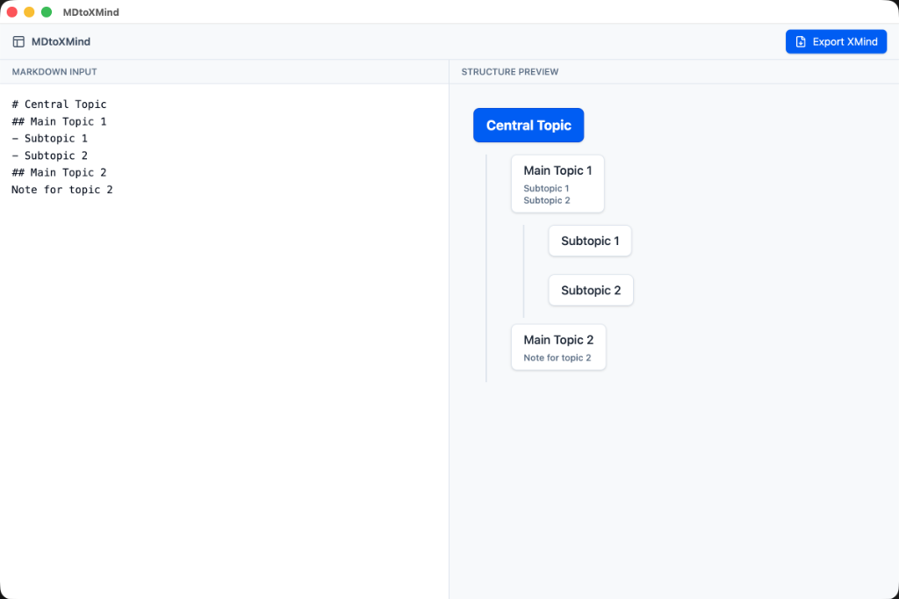

# MDtoXMind

[English](README_EN.md) | 中文

MDtoXMind 是一款基于 Electron 和 React 开发的桌面应用程序，旨在将 Markdown 文件快速转换为 XMind ZEN 兼容的思维导图。

它专为 macOS 设计，同时兼容 Windows，提供简洁的图形化界面，支持拖拽导入、实时预览以及图片和备注的自动转换。



## ✨ 主要特性

- **Markdown 解析**: 支持标题（H1-H6）转主题、列表转子主题。
- **XMind ZEN 兼容**: 生成 `.xmind` 文件，完美兼容最新版 XMind 软件。
- **图片支持**:
  - ✅ 支持网络图片（自动下载并嵌入）。
  - ✅ 支持本地图片（自动读取并嵌入）。
- **备注支持**: 标题下方的正文段落自动转换为节点备注。
- **隐私安全**: 所有数据处理均在本地完成，无需上传服务器。
- **免维护**: 提供打包好的独立安装包，无需配置开发环境。

## 📦 获取与安装 (小白必读)

由于 GitHub 文件大小限制（>100MB），我们可能无法直接提供最新的安装包下载。**强烈建议**您按照以下简单步骤自行打包，只需 5 分钟即可获得“免维护”的独立安装包。

### 🛠️ 极简打包教程

1.  **安装环境**:
    *   访问 [Node.js 官网](https://nodejs.org/) 下载并安装 "LTS" 版本。
2.  **下载代码**:
    *   点击本页面右上角的绿色 **Code** 按钮，选择 **Download ZIP**。
    *   解压下载的压缩包。
3.  **开始打包**:
    *   **Mac 用户**:
        1.  打开“终端”应用 (Terminal)。
        2.  输入 `cd ` (注意有个空格)，然后把解压后的文件夹拖进终端窗口，按回车。
        3.  输入 `npm install` 并回车，等待进度条跑完（可能需要几分钟）。
        4.  输入 `npm run dist` 并回车。
    *   **Windows 用户**:
        1.  进入解压后的文件夹。
        2.  在地址栏输入 `cmd` 并回车打开命令行。
        3.  输入 `npm install` 并回车。
        4.  输入 `npm run dist` 并回车。
4.  **获取软件**:
    *   打包完成后，打开项目目录下的 `release` 文件夹。
    *   **Mac**: 双击 `MDtoXMind-x.x.x.dmg` 安装。
    *   **Windows**: 双击 `MDtoXMind-x.x.x.exe` 安装。

## 📖 使用指南

1. **启动应用**: 打开 MDtoXMind。
2. **导入 Markdown**:
   - 直接在左侧编辑器输入或粘贴 Markdown 文本。
   - 或者将 `.md` 文件拖入应用窗口。
3. **预览**: 右侧窗口将实时显示思维导图的层级结构。
4. **导出**: 点击右上角的 "Export XMind" 按钮，保存 `.xmind` 文件。
5. **打开**: 使用 XMind 软件打开生成的文件的进行进一步编辑。

## 🛠️ 本地开发

如果您想参与开发或自行构建，请按以下步骤操作：

### 环境要求
- Node.js (v16 或更高版本)
- npm

### 安装依赖
```bash
git clone https://github.com/yourusername/MDtoXMind.git
cd MDtoXMind
npm install
```

### 启动开发服务器
```bash
npm run dev
```
此命令将同时启动 Vite 开发服务器和 Electron 应用窗口。

### 构建安装包

**构建 macOS 应用 (.dmg)**:
```bash
npm run dist
```
构建产物位于 `release/` 目录。

**构建 Windows 应用 (.exe)**:
需在 Windows 环境下运行，或配置 CI/CD：
```bash
npm run dist
```

## 🏗️ 技术栈

- **Core**: [Electron](https://www.electronjs.org/)
- **UI**: [React](https://reactjs.org/) + [Vite](https://vitejs.dev/)
- **Styling**: [TailwindCSS](https://tailwindcss.com/)
- **Parser**: [Remark](https://github.com/remarkjs/remark)
- **Generator**: [JSZip](https://stuk.github.io/jszip/)

## 📄 许可证

本项目采用 ISC 许可证。详情请参阅 [LICENSE](LICENSE) 文件。
